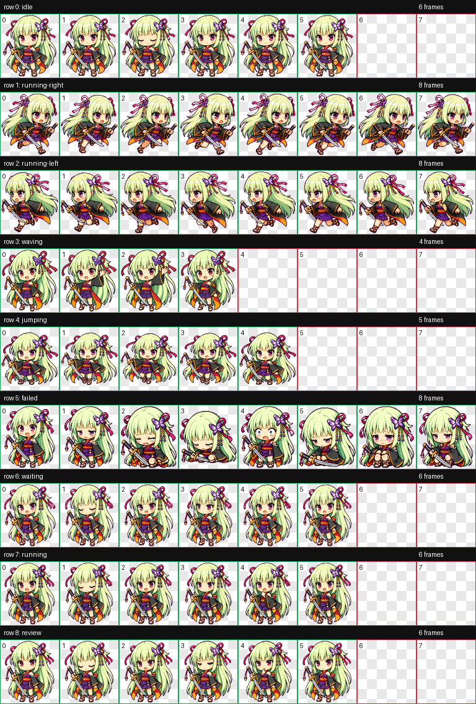

# ムラサメ Codex ペット

[English](README.md) | [中文](README.zh-CN.md)

『千恋＊万花』のムラサメをモチーフにした、非公式のファンメイド Codex ペットです。

## プレビュー



このペットには、Codex 互換のアニメーションスプライトシートが含まれています。対応している状態は次の通りです。

- idle
- running-right
- running-left
- waving
- jumping
- failed
- waiting
- running
- review

## インストール

このリポジトリを clone またはダウンロードし、`murasame` フォルダを Codex のペットディレクトリに配置してください。

```bash
mkdir -p ~/.codex/pets
cp -R murasame ~/.codex/pets/
```

最終的な構成は次のようになります。

```text
~/.codex/pets/murasame/
  pet.json
  spritesheet.webp
```

Codex を再起動または更新し、ペット選択画面で `丛雨` を選択してください。

## ファイル

- `murasame/pet.json`: Codex ペットのマニフェスト。
- `murasame/spritesheet.webp`: 8 x 9 の Codex ペット用アニメーションアトラス。

## 免責事項

これは非公式のファンメイド Codex ペットです。Murasame / 丛雨、Senren Banka / 千恋＊万花、および関連する原作コンテンツの権利は、それぞれの権利者に帰属します。

このリポジトリは、原作者または権利者と提携しておらず、承認を受けたものでもありません。

同梱されているペットスプライトシートは、個人利用および非商用利用のみを想定しています。
